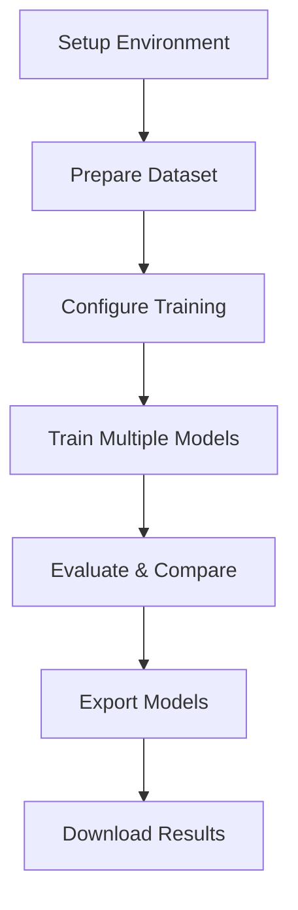

# 🚀 YOLOv11 Person Detection Training on Google Colab

This notebook trains custom YOLOv11 models specifically for person detection optimized for CCTV/surveillance scenarios.

## 📋 Notebook Overview



## 🔧 Cell 1: Setup and Installation

```python
"""
🚀 YOLOv11 Person Detection Training Setup
This cell installs all required packages and sets up the environment
"""

# Check GPU availability
import torch
print(f"🔥 CUDA Available: {torch.cuda.is_available()}")
if torch.cuda.is_available():
    print(f"🎮 GPU: {torch.cuda.get_device_name(0)}")
    print(f"💾 GPU Memory: {torch.cuda.get_device_properties(0).total_memory / 1e9:.1f} GB")

# Install required packages
!pip install ultralytics roboflow supervision
!pip install -q kaggle wandb  # For dataset downloading and experiment tracking
!pip install opencv-python matplotlib seaborn plotly
!pip install albumentations imgaug  # For advanced augmentations

# Imports
import os
import shutil
import yaml
import cv2
import numpy as np
import matplotlib.pyplot as plt
from pathlib import Path
import json
from datetime import datetime
import zipfile
import requests
from google.colab import files, drive
import pandas as pd
from ultralytics import YOLO
import wandb
from tqdm import tqdm
import random

# Mount Google Drive for persistent storage
drive.mount('/content/drive')

# Create project directories
project_dir = Path('/content/drive/MyDrive/CCTV_YOLOv11_Training')
project_dir.mkdir(exist_ok=True)

data_dir = project_dir / 'data'
models_dir = project_dir / 'models'
results_dir = project_dir / 'results'

for dir_path in [data_dir, models_dir, results_dir]:
    dir_path.mkdir(exist_ok=True)

print("✅ Setup complete!")
print(f"📁 Project directory: {project_dir}")
```

## 📊 Cell 2: Dataset Preparation

```python
"""
📊 Dataset Preparation for Person Detection
Handles multiple dataset sources and formats
"""

class DatasetPreparer:
    def __init__(self, data_dir):
        self.data_dir = Path(data_dir)
        self.dataset_formats = ['coco', 'yolo', 'pascal_voc']
    
    def download_coco_subset(self, categories=['person'], subset_size=5000):
        """Download COCO dataset subset focused on person detection"""
        print("📥 Downloading COCO person detection subset...")
        
        # Install pycocotools if not available
        try:
            from pycocotools.coco import COCO
        except ImportError:
            !pip install pycocotools
            from pycocotools.coco import COCO
        
        import urllib.request
        
        # Download COCO annotations
        ann_url = 'http://images.cocodataset.org/annotations/annotations_trainval2017.zip'
        ann_file = self.data_dir / 'annotations_trainval2017.zip'
        
        if not ann_file.exists():
            print("Downloading COCO annotations...")
            urllib.request.urlretrieve(ann_url, ann_file)
            
            # Extract annotations
            with zipfile.ZipFile(ann_file, 'r') as zip_ref:
                zip_ref.extractall(self.data_dir)
        
        # Initialize COCO api for train2017
        coco = COCO(self.data_dir / 'annotations/instances_train2017.json')
        
        # Get person category ID
        cat_ids = coco.getCatIds(catNms=['person'])
        
        # Get image IDs containing persons
        img_ids = coco.getImgIds(catIds=cat_ids)
        
        # Limit subset size
        img_ids = img_ids[:subset_size]
        
        print(f"📊 Found {len(img_ids)} images with person annotations")
        
        # Create dataset structure
        for split in ['train', 'val', 'test']:
            (self.data_dir / f'images/{split}').mkdir(parents=True, exist_ok=True)
            (self.data_dir / f'labels/{split}').mkdir(parents=True, exist_ok=True)
        
        # Split data: 70% train, 20% val, 10% test
        train_end = int(len(img_ids) * 0.7)
        val_end = int(len(img_ids) * 0.9)
        
        splits = {
            'train': img_ids[:train_end],
            'val': img_ids[train_end:val_end],
            'test': img_ids[val_end:]
        }
        
        # Download images and convert annotations
        for split, split_img_ids in splits.items():
            print(f"Processing {split} split ({len(split_img_ids)} images)...")
            
            downloaded_count = 0
            for i, img_id in enumerate(tqdm(split_img_ids[:1000])):  # Limit for demo
                try:
                    # Get image info
                    img_info = coco.loadImgs(img_id)[0]
                    img_url = img_info['coco_url']
                    img_filename = img_info['file_name']
                    
                    # Download image
                    img_path = self.data_dir / f'images/{split}' / img_filename
                    if not img_path.exists():
                        urllib.request.urlretrieve(img_url, img_path)
                    
                    # Get annotations for this image
                    ann_ids = coco.getAnnIds(imgIds=img_id, catIds=cat_ids)
                    anns = coco.loadAnns(ann_ids)
                    
                    # Convert to YOLO format
                    img_height, img_width = img_info['height'], img_info['width']
                    yolo_annotations = []
                    
                    for ann in anns:
                        bbox = ann['bbox']  # [x, y, width, height]
                        x_center = (bbox[0] + bbox[2] / 2) / img_width
                        y_center = (bbox[1] + bbox[3] / 2) / img_height
                        width = bbox[2] / img_width
                        height = bbox[3] / img_height
                        
                        # Class 0 for person
                        yolo_annotations.append(f"0 {x_center:.6f} {y_center:.6f} {width:.6f} {height:.6f}")
                    
                    # Save YOLO format annotation
                    label_path = self.data_dir / f'labels/{split}' / f"{img_filename.split('.')[0]}.txt"
                    with open(label_path, 'w') as f:
                        f.write('\n'.join(yolo_annotations))
                    
                    downloaded_count += 1
                    
                except Exception as e:
                    print(f"⚠️ Error processing image {img_id}: {e}")
                    continue
            
            print(f"✅ Downloaded {downloaded_count} {split} images")
        
        return True
    
    def create_synthetic_dataset(self, num_samples_per_split={'train': 1000, 'val': 200, 'test': 100}):
        """Create synthetic person detection dataset for demonstration"""
        print("🎨 Creating synthetic person detection dataset...")
        
        for split, num_samples in num_samples_per_split.items():
            print(f"Creating {num_samples} {split} samples...")
            
            images_dir = self.data_dir / f'images/{split}'
            labels_dir = self.data_dir / f'labels/{split}'
            images_dir.mkdir(parents=True, exist_ok=True)
            labels_dir.mkdir(parents=True, exist_ok=True)
            
            for i in tqdm(range(num_samples)):
                # Create synthetic image
                img = np.random.randint(50, 255, (640, 640, 3), dtype=np.uint8)
                
                # Add background elements
                # Add some rectangular buildings/structures
                for _ in range(random.randint(2, 5)):
                    x = random.randint(0, 500)
                    y = random.randint(0, 400)
                    w = random.randint(50, 100)
                    h = random.randint(100, 200)
                    color = (random.randint(100, 150), random.randint(100, 150), random.randint(100, 150))
                    cv2.rectangle(img, (x, y), (x+w, y+h), color, -1)
                
                # Add person-like objects
                num_persons = random.randint(1, 4)
                annotations = []
                
                for _ in range(num_persons):
                    # Random person bounding box
                    person_width = random.randint(40, 100)
                    person_height = random.randint(100, 200)
                    x = random.randint(0, 640 - person_width)
                    y = random.randint(0, 640 - person_height)
                    
                    # Draw person-like shape
                    # Body
                    body_color = (random.randint(50, 200), random.randint(50, 200), random.randint(50, 200))
                    cv2.rectangle(img, (x + 10, y + 30), (x + person_width - 10, y + person_height - 20), body_color, -1)
                    
                    # Head
                    head_size = person_width // 3
                    head_x = x + person_width // 2 - head_size // 2
                    head_y = y + 5
                    head_color = (random.randint(150, 255), random.randint(120, 200), random.randint(100, 180))
                    cv2.circle(img, (head_x + head_size // 2, head_y + head_size // 2), head_size // 2, head_color, -1)
                    
                    # Convert to YOLO format
                    x_center = (x + person_width / 2) / 640
                    y_center = (y + person_height / 2) / 640
                    width = person_width / 640
                    height = person_height / 640
                    
                    annotations.append(f"0 {x_center:.6f} {y_center:.6f} {width:.6f} {height:.6f}")
                
                # Save image and annotation
                img_path = images_dir / f'person_{i:04d}.jpg'
                cv2.imwrite(str(img_path), img)
                
                label_path = labels_dir / f'person_{i:04d}.txt'
                with open(label_path, 'w') as f:
                    f.write('\n'.join(annotations))
        
        print("✅ Synthetic dataset created successfully!")
    
    def create_dataset_yaml(self):
        """Create dataset.yaml file for YOLO training"""
        dataset_config = {
            'path': str(self.data_dir),
            'train': 'images/train',
            'val': 'images/val',
            'test': 'images/test',
            'nc': 1,  # Number of classes
            'names': ['person']
        }
        
        yaml_path = self.data_dir / 'dataset.yaml'
        with open(yaml_path, 'w') as f:
            yaml.dump(dataset_config, f, default_flow_style=False)
        
        print(f"✅ Dataset YAML created: {yaml_path}")
        return yaml_path

# Initialize dataset preparer
preparer = DatasetPreparer(data_dir)

# Choose your dataset option:
print("Choose dataset option:")
print("1. Synthetic dataset (quick, for demonstration)")
print("2. COCO subset (real data, takes longer)")

dataset_choice = input("Enter choice (1 or 2): ").strip()

if dataset_choice == "2":
    preparer.download_coco_subset(subset_size=2000)
else:
    preparer.create_synthetic_dataset()

# Create dataset YAML
dataset_yaml = preparer.create_dataset_yaml()
```

## 🏗️ Cell 3: Training Configuration and Setup

```python
"""
🏗️ YOLOv11 Training Configuration
Sets up training parameters and experiment tracking
"""

class YOLOTrainer:
    def __init__(self, project_dir, use_wandb=True):
        self.project_dir = Path(project_dir)
        self.models_dir = self.project_dir / 'models'
        self.results_dir = self.project_dir / 'results'
        self.use_wandb = use_wandb
        
        # Ensure directories exist
        self.models_dir.mkdir(exist_ok=True)
        self.results_dir.mkdir(exist_ok=True)
        
        if use_wandb:
            print("Setting up Weights & Biases...")
            try:
                wandb.login()  # You'll need to enter your API key
                print("✅ Weights & Biases connected")
            except:
                print("⚠️ Weights & Biases setup failed, continuing without logging")
                self.use_wandb = False
    
    def verify_dataset(self, dataset_yaml):
        """Verify dataset structure and show statistics"""
        data_path = Path(dataset_yaml).parent
        
        print("📊 Dataset Verification:")
        print("=" * 40)
        
        total_images = 0
        total_labels = 0
        
        for split in ['train', 'val', 'test']:
            img_dir = data_path / f'images/{split}'
            label_dir = data_path / f'labels/{split}'
            
            if img_dir.exists() and label_dir.exists():
                num_images = len(list(img_dir.glob('*.jpg'))) + len(list(img_dir.glob('*.png')))
                num_labels = len(list(label_dir.glob('*.txt')))
                
                print(f"{split:5}: {num_images:4d} images, {num_labels:4d} labels")
                total_images += num_images
                total_labels += num_labels
                
                # Sample annotation analysis
                if num_labels > 0:
                    sample_label = list(label_dir.glob('*.txt'))[0]
                    with open(sample_label, 'r') as f:
                        lines = f.readlines()
                    print(f"       Sample has {len(lines)} person(s)")
        
        print("=" * 40)
        print(f"Total: {total_images} images, {total_labels} labels")
        
        if total_images == 0:
            raise ValueError("No images found! Please check dataset preparation.")
        
        return True
    
    def train_model(self, 
                   dataset_yaml,
                   model_size='n',  # n, s, m, l, x
                   epochs=100,
                   imgsz=640,
                   batch_size=16,
                   workers=2,
                   patience=10,
                   optimizer='AdamW',
                   lr0=0.01,
                   weight_decay=0.0005,
                   warmup_epochs=3,
                   augment=True):
        """Train YOLOv11 for person detection"""
        
        print(f"🚀 Starting YOLOv8{model_size} training for person detection...")
        
        # Initialize model
        model = YOLO(f'yolov8{model_size}.pt')  # Download pretrained weights
        
        # Training arguments
        train_args = {
            'data': str(dataset_yaml),
            'epochs': epochs,
            'imgsz': imgsz,
            'batch': batch_size,
            'workers': workers,
            'patience': patience,
            'optimizer': optimizer,
            'lr0': lr0,
            'weight_decay': weight_decay,
            'warmup_epochs': warmup_epochs,
            'project': str(self.results_dir),
            'name': f'person_detector_yolov8{model_size}',
            'save_period': max(1, epochs // 10),  # Save checkpoint every 10% of epochs
            'device': 0 if torch.cuda.is_available() else 'cpu',
            'exist_ok': True,
            'pretrained': True,
            'verbose': True,
            'seed': 42,
            'deterministic': True,
            'single_cls': True,  # Single class (person) optimization
            'rect': True,  # Rectangular training
            'cos_lr': True,  # Cosine learning rate scheduler
            'close_mosaic': max(1, epochs // 10),  # Disable mosaic in last 10% of epochs
            'resume': False,
            'amp': True,  # Automatic Mixed Precision
        }
        
        # Add data augmentation parameters
        if augment:
            train_args.update({
                'hsv_h': 0.015,  # Hue augmentation
                'hsv_s': 0.7,    # Saturation augmentation  
                'hsv_v': 0.4,    # Value augmentation
                'degrees': 10.0,  # Rotation degrees
                'translate': 0.1, # Translation fraction
                'scale': 0.5,     # Scale fraction
                'shear': 0.0,     # Shear degrees
                'perspective': 0.0, # Perspective fraction
                'flipud': 0.0,    # Vertical flip probability
                'fliplr': 0.5,    # Horizontal flip probability
                'mosaic': 1.0,    # Mosaic probability
                'mixup': 0.1,     # Mixup probability
                'copy_paste': 0.3, # Copy-paste probability
            })
        
        # Initialize W&B if enabled
        if self.use_wandb:
            run = wandb.init(
                project='yolov8-person-detection',
                config=train_args,
                name=f'yolov8{model_size}_person_{datetime.now().strftime("%Y%m%d_%H%M")}',
                tags=['person-detection', f'yolov8{model_size}', 'cctv']
            )
        
        # Start training
        try:
            print(f"📚 Training arguments:")
            for key, value in train_args.items():
                print(f"  {key}: {value}")
            
            results = model.train(**train_args)
            
            # Get paths to best and last models
            exp_dir = self.results_dir / f'person_detector_yolov8{model_size}'
            best_model_path = exp_dir / 'weights' / 'best.pt'
            last_model_path = exp_dir / 'weights' / 'last.pt'
            
            # Copy best model to models directory
            if best_model_path.exists():
                saved_model_path = self.models_dir / f'person_detector_yolov8{model_size}_best.pt'
                shutil.copy(best_model_path, saved_model_path)
                print(f"✅ Best model saved: {saved_model_path}")
            
            # Save training results
            self._save_training_results(results, model_size, exp_dir)
            
            return results, saved_model_path
            
        except Exception as e:
            print(f"❌ Training failed: {e}")
            return None, None
        
        finally:
            if self.use_wandb:
                wandb.finish()
    
    def _save_training_results(self, results, model_size, exp_dir):
        """Save training results and metrics"""
        
        # Extract key metrics from results
        try:
            # Get the results CSV if it exists
            results_csv = exp_dir / 'results.csv'
            if results_csv.exists():
                df = pd.read_csv(results_csv)
                final_metrics = df.iloc[-1].to_dict()
            else:
                final_metrics = {}
            
            metrics = {
                'model_size': model_size,
                'training_completed': datetime.now().isoformat(),
                'final_metrics': final_metrics,
                'training_time': datetime.now().isoformat(),
            }
            
            # Save metrics
            results_file = self.results_dir / f'training_results_yolov8{model_size}.json'
            with open(results_file, 'w') as f:
                json.dump(metrics, f, indent=2, default=str)
            
            print(f"📊 Training results saved: {results_file}")
            
        except Exception as e:
            print(f"⚠️ Error saving training results: {e}")
    
    def compare_models(self):
        """Compare different model sizes"""
        print("📈 Model Comparison:")
        print("=" * 70)
        print(f"{'Model':<15} {'mAP50':<8} {'mAP50-95':<10} {'Precision':<10} {'Recall':<8} {'Size(MB)':<10}")
        print("-" * 70)
        
        for results_file in self.results_dir.glob('training_results_*.json'):
            try:
                with open(results_file, 'r') as f:
                    data = json.load(f)
                
                model = f"YOLOv8{data['model_size']}"
                metrics = data.get('final_metrics', {})
                
                # Extract metrics (column names may vary)
                map50 = metrics.get('metrics/mAP50(B)', metrics.get('mAP_0.5', 0))
                map50_95 = metrics.get('metrics/mAP50-95(B)', metrics.get('mAP_0.5:0.95', 0))
                precision = metrics.get('metrics/precision(B)', metrics.get('precision', 0))
                recall = metrics.get('metrics/recall(B)', metrics.get('recall', 0))
                
                # Estimate model size
                size_map = {'n': 6, 's': 22, 'm': 50, 'l': 88, 'x': 136}
                size_mb = size_map.get(data['model_size'], 0)
                
                print(f"{model:<15} {map50:<8.3f} {map50_95:<10.3f} {precision:<10.3f} {recall:<8.3f} {size_mb:<10}")
                
            except Exception as e:
                print(f"⚠️ Error reading {results_file}: {e}")
        
        print("=" * 70)

# Initialize trainer
trainer = YOLOTrainer(project_dir, use_wandb=True)

# Verify dataset
trainer.verify_dataset(dataset_yaml)
```

## 🏃‍♂️ Cell 4: Train Multiple Model Sizes

```python
"""
🏃‍♂️ Train Multiple YOLOv8 Model Sizes
Trains nano, small, and medium models for comparison
"""

# Training configurations for different model sizes
model_configs = [
    {
        'size': 'n', 
        'epochs': 50, 
        'batch': 32,
        'description': 'Nano - Fastest inference, lowest accuracy'
    },
    {
        'size': 's', 
        'epochs': 75, 
        'batch': 24,
        'description': 'Small - Balanced speed and accuracy'
    },
    {
        'size': 'm', 
        'epochs': 100, 
        'batch': 16,
        'description': 'Medium - Higher accuracy, slower inference'
    }
]

training_results = {}

print("🚀 Starting multi-model training...")
print("This will train multiple model sizes for comparison")

for i, config in enumerate(model_configs):
    print(f"\n{'='*60}")
    print(f"🔥 Training {i+1}/{len(model_configs)}: YOLOv8{config['size']}")
    print(f"📝 {config['description']}")
    print(f"⚙️ Epochs: {config['epochs']}, Batch: {config['batch']}")
    print(f"{'='*60}")
    
    # Confirm before starting (optional)
    if i == 0:  # Only ask for first model
        user_input = input(f"Start training YOLOv8{config['size']}? (y/n): ").strip().lower()
        if user_input != 'y':
            print("Training cancelled.")
            break
    
    try:
        results, model_path = trainer.train_model(
            dataset_yaml=dataset_yaml,
            model_size=config['size'],
            epochs=config['epochs'],
            batch_size=config['batch'],
            augment=True,
            patience=15  # Early stopping patience
        )
        
        if results and model_path:
            training_results[config['size']] = {
                'results': results,
                'model_path': model_path,
                'config': config
            }
            print(f"✅ YOLOv8{config['size']} training completed successfully!")
            
            # Quick validation
            model = YOLO(str(model_path))
            val_results = model.val(data=str(dataset_yaml), verbose=False)
            print(f"📊 Validation mAP50: {val_results.box.map50:.3f}")
            print(f"📊 Validation mAP50-95: {val_results.box.map:.3f}")
            
        else:
            print(f"❌ YOLOv8{config['size']} training failed!")
            
    except KeyboardInterrupt:
        print(f"\n⏹️ Training interrupted by user")
        break
    except Exception as e:
        print(f"❌ YOLOv8{config['size']} training failed with error: {e}")
        continue

print(f"\n🎯 Training Summary:")
print(f"Successfully trained: {list(training_results.keys())}")

# Compare all trained models
if training_results:
    trainer.compare_models()
```

## 📊 Cell 5: Model Evaluation and Validation

```python
"""
📊 Model Evaluation and Validation
Comprehensive evaluation of trained models
"""

def evaluate_model(model_path, dataset_yaml, model_name):
    """Comprehensive model evaluation"""
    print(f"📊 Evaluating {model_name}...")
    
    try:
        model = YOLO(model_path)
        
        # Run validation
        results = model.val(
            data=dataset_yaml,
            imgsz=640,
            batch=16,
            conf=0.001,  # Low confidence for comprehensive evaluation
            iou=0.6,
            device=0 if torch.cuda.is_available() else 'cpu',
            plots=True,
            save_json=True,
            verbose=True
        )
        
        # Extract metrics
        metrics = {
            'model_name': model_name,
            'mAP50': float(results.box.map50),
            'mAP50_95': float(results.box.map),
            'precision': float(results.box.mp),
            'recall': float(results.box.mr),
            'f1_score': float(2 * results.box.mp * results.box.mr / (results.box.mp + results.box.mr)) if (results.box.mp + results.box.mr) > 0 else 0,
        }
        
        print(f"Results for {model_name}:")
        print(f"  mAP50: {metrics['mAP50']:.3f}")
        print(f"  mAP50-95: {metrics['mAP50_95']:.3f}")
        print(f"  Precision: {metrics['precision']:.3f}")
        print(f"  Recall: {metrics['recall']:.3f}")
        print(f"  F1-Score: {metrics['f1_score']:.3f}")
        
        return metrics
        
    except Exception as e:
        print(f"❌ Evaluation failed for {model_name}: {e}")
        return None

def test_inference_speed(model_path, model_name, num_images=100):
    """Test inference speed"""
    print(f"⚡ Testing inference speed for {model_name}...")
    
    try:
        model = YOLO(model_path)
        
        # Create test images
        test_images = [np.random.randint(0, 255, (640, 640, 3), dtype=np.uint8) for _ in range(num_images)]
        
        # Warm up
        for _ in range(10):
            model(test_images[0], verbose=False)
        
        # Time inference
        start_time = time.time()
        for img in test_images:
            model(img, verbose=False)
        total_time = time.time() - start_time
        
        avg_inference_time = total_time / num_images
        fps = 1.0 / avg_inference_time
        
        print(f"  Average inference time: {avg_inference_time*1000:.1f}ms")
        print(f"  Estimated FPS: {fps:.1f}")
        
        return {
            'avg_inference_time': avg_inference_time,
            'fps': fps,
            'total_time': total_time
        }
        
    except Exception as e:
        print(f"❌ Speed test failed for {model_name}: {e}")
        return None

# Evaluate all trained models
evaluation_results = {}

print("🧪 Starting comprehensive model evaluation...")

for size, training_data in training_results.items():
    model_path = training_data['model_path']
    model_name = f"YOLOv8{size}"
    
    print(f"\n{'='*50}")
    print(f"Evaluating {model_name}")
    print(f"{'='*50}")
    
    # Validation metrics
    val_metrics = evaluate_model(model_path, dataset_yaml, model_name)
    
    # Speed test
    speed_metrics = test_inference_speed(model_path, model_name)
    
    # Combine results
    if val_metrics and speed_metrics:
        evaluation_results[size] = {
            **val_metrics,
            **speed_metrics,
            'model_path': str(model_path)
        }

# Create comparison visualization
if evaluation_results:
    import matplotlib.pyplot as plt
    
    fig, ((ax1, ax2), (ax3, ax4)) = plt.subplots(2, 2, figsize=(15, 10))
    
    models = list(evaluation_results.keys())
    
    # mAP50 comparison
    map50_values = [evaluation_results[m]['mAP50'] for m in models]
    ax1.bar(models, map50_values, color='skyblue')
    ax1.set_title('mAP50 Comparison')
    ax1.set_ylabel('mAP50')
    for i, v in enumerate(map50_values):
        ax1.text(i, v + 0.01, f'{v:.3f}', ha='center')
    
    # Precision vs Recall
    precision_values = [evaluation_results[m]['precision'] for m in models]
    recall_values = [evaluation_results[m]['recall'] for m in models]
    ax2.scatter(recall_values, precision_values, s=100, c=['red', 'green', 'blue'][:len(models)])
    for i, model in enumerate(models):
        ax2.annotate(model, (recall_values[i], precision_values[i]), xytext=(5, 5), textcoords='offset points')
    ax2.set_xlabel('Recall')
    ax2.set_ylabel('Precision')
    ax2.set_title('Precision vs Recall')
    ax2.grid(True)
    
    # Inference Speed
    fps_values = [evaluation_results[m]['fps'] for m in models]
    ax3.bar(models, fps_values, color='lightgreen')
    ax3.set_title('Inference Speed (FPS)')
    ax3.set_ylabel('FPS')
    for i, v in enumerate(fps_values):
        ax3.text(i, v + 1, f'{v:.1f}', ha='center')
    
    # Speed vs Accuracy Trade-off
    ax4.scatter(fps_values, map50_values, s=100, c=['red', 'green', 'blue'][:len(models)])
    for i, model in enumerate(models):
        ax4.annotate(model, (fps_values[i], map50_values[i]), xytext=(5, 5), textcoords='offset points')
    ax4.set_xlabel('FPS')
    ax4.set_ylabel('mAP50')
    ax4.set_title('Speed vs Accuracy Trade-off')
    ax4.grid(True)
    
    plt.tight_layout()
    plt.savefig(results_dir / 'model_comparison.png', dpi=300, bbox_inches='tight')
    plt.show()
    
    print("\n📊 Evaluation complete! Comparison chart saved.")

# Save detailed evaluation results
with open(results_dir / 'evaluation_results.json', 'w') as f:
    json.dump(evaluation_results, f, indent=2)

print(f"💾 Detailed evaluation results saved to: {results_dir / 'evaluation_results.json'}")
```

## 🎯 Cell 6: Test Inference on Sample Images

```python
"""
🎯 Test Inference on Sample Images
Visual testing of trained models
"""

def test_model_inference(model_path, model_name, test_images_dir=None, num_test_images=5):
    """Test model inference and visualize results"""
    print(f"🧪 Testing inference for {model_name}...")
    
    model = YOLO(model_path)
    
    # Get test images
    if test_images_dir and Path(test_images_dir).exists():
        test_images = list(Path(test_images_dir).glob('*.jpg'))[:num_test_images]
    else:
        # Create synthetic test images
        print("Creating synthetic test images...")
        test_images = []
        for i in range(num_test_images):
            # Create more realistic test image
            img = np.random.randint(100, 200, (640, 640, 3), dtype=np.uint8)
            
            # Add background
            cv2.rectangle(img, (0, 500), (640, 640), (120, 120, 120), -1)  # Floor
            cv2.rectangle(img, (0, 0), (640, 100), (150, 200, 250), -1)    # Sky
            
            # Add person-like objects
            for j in range(random.randint(1, 3)):
                x = random.randint(50, 550)
                y = random.randint(200, 450)
                w = random.randint(40, 80)
                h = random.randint(120, 200)
                
                # Person body
                cv2.rectangle(img, (x, y), (x+w, y+h), (60, 100, 180), -1)
                # Person head
                cv2.circle(img, (x + w//2, y - 15), w//4, (220, 180, 160), -1)
            
            test_images.append(img)
    
    # Run inference and visualize
    fig, axes = plt.subplots(1, min(len(test_images), 5), figsize=(20, 4))
    if len(test_images) == 1:
        axes = [axes]
    elif len(test_images) == 0:
        print("No test images available")
        return
    
    results_summary = []
    
    for i, img_input in enumerate(test_images[:5]):
        if isinstance(img_input, np.ndarray):
            img = img_input
            img_name = f"synthetic_{i}"
        else:
            img = cv2.imread(str(img_input))
            img_name = img_input.name
            if img is None:
                continue
        
        # Run inference
        results = model(img, conf=0.3, verbose=False)
        
        # Plot results
        result_img = results[0].plot(conf=True, line_width=2, font_size=12)
        
        # Convert BGR to RGB for matplotlib
        if len(result_img.shape) == 3:
            result_img_rgb = cv2.cvtColor(result_img, cv2.COLOR_BGR2RGB)
        else:
            result_img_rgb = result_img
        
        axes[i].imshow(result_img_rgb)
        
        # Count detections
        num_detections = len(results[0].boxes) if results[0].boxes is not None else 0
        axes[i].set_title(f"{img_name}\nDetections: {num_detections}", fontsize=10)
        axes[i].axis('off')
        
        # Store results
        if results[0].boxes is not None:
            confidences = results[0].boxes.conf.cpu().numpy()
            avg_conf = np.mean(confidences) if len(confidences) > 0 else 0
        else:
            avg_conf = 0
        
        results_summary.append({
            'image': img_name,
            'detections': num_detections,
            'avg_confidence': avg_conf
        })
    
    plt.tight_layout()
    plt.savefig(results_dir / f'{model_name}_inference_test.png', dpi=300, bbox_inches='tight')
    plt.show()
    
    # Print summary
    print(f"\n📊 Inference Summary for {model_name}:")
    total_detections = sum(r['detections'] for r in results_summary)
    avg_detections = total_detections / len(results_summary) if results_summary else 0
    
    print(f"  Total detections: {total_detections}")
    print(f"  Average detections per image: {avg_detections:.1f}")
    
    for result in results_summary:
        print(f"  {result['image']}: {result['detections']} detections (conf: {result['avg_confidence']:.3f})")
    
    return results_summary

# Test all trained models
print("🎯 Testing inference on sample images...")

inference_summaries = {}

for size, training_data in training_results.items():
    model_path = training_data['model_path']
    model_name = f"YOLOv8{size}"
    
    print(f"\n{'-'*40}")
    print(f"Testing {model_name}")
    print(f"{'-'*40}")
    
    try:
        summary = test_model_inference(model_path, model_name)
        inference_summaries[size] = summary
    except Exception as e:
        print(f"❌ Inference test failed for {model_name}: {e}")

print("\n✅ Inference testing complete!")
```

## 📦 Cell 7: Export Models for Deployment

```python
"""
📦 Export Models for Deployment
Convert models to different formats for various deployment scenarios
"""

def export_model_formats(model_path, model_name, export_formats=['onnx', 'torchscript', 'tflite']):
    """Export model to different formats"""
    print(f"📦 Exporting {model_name} to multiple formats...")
    
    model = YOLO(model_path)
    exported_models = {}
    
    for format_type in export_formats:
        try:
            print(f"  Exporting to {format_type.upper()}...")
            
            if format_type == 'onnx':
                export_path = model.export(
                    format='onnx', 
                    dynamic=False,
                    simplify=True,
                    imgsz=640
                )
                exported_models['onnx'] = export_path
                print(f"    ✅ ONNX export: {export_path}")
                
            elif format_type == 'torchscript':
                export_path = model.export(
                    format='torchscript',
                    imgsz=640
                )
                exported_models['torchscript'] = export_path
                print(f"    ✅ TorchScript export: {export_path}")
                
            elif format_type == 'tflite':
                export_path = model.export(
                    format='tflite',
                    imgsz=640,
                    int8=False  # Set to True for quantized model
                )
                exported_models['tflite'] = export_path
                print(f"    ✅ TensorFlow Lite export: {export_path}")
                
            elif format_type == 'openvino':
                export_path = model.export(
                    format='openvino',
                    imgsz=640
                )
                exported_models['openvino'] = export_path
                print(f"    ✅ OpenVINO export: {export_path}")
                
        except Exception as e:
            print(f"    ❌ {format_type.upper()} export failed: {e}")
    
    return exported_models

# Export all trained models
all_exported_models = {}

print("📦 Starting model export process...")

export_formats = ['onnx', 'torchscript']  # Start with most common formats

for size, training_data in training_results.items():
    model_path = training_data['model_path']
    model_name = f"YOLOv8{size}"
    
    print(f"\n{'='*50}")
    print(f"Exporting {model_name}")
    print(f"{'='*50}")
    
    try:
        exported = export_model_formats(model_path, model_name, export_formats)
        all_exported_models[size] = exported
        
        # Copy exported models to models directory
        for format_type, path in exported.items():
            if path and Path(path).exists():
                dest_path = models_dir / f"{model_name}_{format_type}.{format_type}"
                shutil.copy(path, dest_path)
                print(f"    📁 Copied to: {dest_path}")
                
    except Exception as e:
        print(f"❌ Export failed for {model_name}: {e}")

print(f"\n✅ Model export complete!")
print(f"📁 All models saved in: {models_dir}")
```

## 💾 Cell 8: Download Trained Models and Results

```python
"""
💾 Download Trained Models and Results
Package everything for download and use in local pipeline
"""

def create_download_package():
    """Create a comprehensive download package"""
    print("📦 Creating download package...")
    
    # Create download directory
    download_dir = Path('/content/trained_models_package')
    download_dir.mkdir(exist_ok=True)
    
    # Package structure
    package_structure = {
        'models': download_dir / 'models',
        'results': download_dir / 'results', 
        'configs': download_dir / 'configs',
        'docs': download_dir / 'docs'
    }
    
    for dir_path in package_structure.values():
        dir_path.mkdir(exist_ok=True)
    
    # Copy trained models
    models_copied = 0
    for model_file in models_dir.glob('*.pt'):
        shutil.copy(model_file, package_structure['models'])
        models_copied += 1
        print(f"  📄 Copied: {model_file.name}")
    
    # Copy exported models
    for model_file in models_dir.glob('*.onnx'):
        shutil.copy(model_file, package_structure['models'])
        print(f"  📄 Copied: {model_file.name}")
    
    for model_file in models_dir.glob('*.torchscript'):
        shutil.copy(model_file, package_structure['models'])
        print(f"  📄 Copied: {model_file.name}")
    
    # Copy evaluation results
    for result_file in results_dir.glob('*.json'):
        shutil.copy(result_file, package_structure['results'])
        print(f"  📊 Copied: {result_file.name}")
    
    # Copy dataset configuration
    if dataset_yaml.exists():
        shutil.copy(dataset_yaml, package_structure['configs'] / 'dataset.yaml')
        print(f"  ⚙️ Copied: dataset.yaml")
    
    # Create training summary
    summary = {
        'training_date': datetime.now().isoformat(),
        'models_trained': list(training_results.keys()) if training_results else [],
        'best_model': None,
        'dataset_info': {
            'dataset_path': str(dataset_yaml.parent),
            'classes': ['person'],
            'splits': ['train', 'val', 'test']
        },
        'evaluation_results': evaluation_results if 'evaluation_results' in globals() else {},
        'export_formats': list(all_exported_models.keys()) if 'all_exported_models' in globals() else [],
        'usage_instructions': {
            'basic_inference': 'model = YOLO("person_detector_yolov8n_best.pt"); results = model("image.jpg")',
            'pipeline_integration': 'Use PersonDetector class with model_path parameter',
            'batch_processing': 'results = model(["img1.jpg", "img2.jpg", "img3.jpg"])'
        },
        'recommended_usage': {
            'real_time_cctv': 'Use YOLOv8n for fastest inference',
            'high_accuracy': 'Use YOLOv8m for best accuracy',
            'balanced': 'Use YOLOv8s for balanced speed/accuracy'
        }
    }
    
    # Determine best model based on evaluation
    if evaluation_results:
        best_model_key = max(evaluation_results.keys(), 
                           key=lambda k: evaluation_results[k]['mAP50'])
        summary['best_model'] = f"YOLOv8{best_model_key}"
        summary['best_model_metrics'] = evaluation_results[best_model_key]
    
    # Save summary
    with open(package_structure['docs'] / 'training_summary.json', 'w') as f:
        json.dump(summary, f, indent=2, default=str)
    
    # Create README
    readme_content = f"""# YOLOv8 Person Detection Models
    
## Training Summary
- **Training Date**: {summary['training_date']}
- **Models Trained**: {', '.join(summary['models_trained'])}
- **Best Model**: {summary.get('best_model', 'N/A')}

## Model Performance
"""
    
    if evaluation_results:
        readme_content += "| Model | mAP50 | mAP50-95 | Precision | Recall | FPS |\n"
        readme_content += "|-------|-------|----------|-----------|--------|-----|\n"
        for model, metrics in evaluation_results.items():
            readme_content += f"| YOLOv8{model} | {metrics['mAP50']:.3f} | {metrics['mAP50_95']:.3f} | {metrics['precision']:.3f} | {metrics['recall']:.3f} | {metrics['fps']:.1f} |\n"
    
    readme_content += f"""
## Usage Instructions

### Basic Inference
```python
from ultralytics import YOLO

# Load model
model = YOLO("models/person_detector_yolov8n_best.pt")

# Run inference
results = model("your_image.jpg")

# Process results
for result in results:
    boxes = result.boxes  # Bounding boxes
    for box in boxes:
        print(f"Person detected with confidence: {{box.conf:.2f}}")
```

### Integration with Enhanced Pipeline
```python
from person_detector import PersonDetector, DetectionConfig

# Configure detector with custom model
config = DetectionConfig(
    model_path="models/person_detector_yolov8s_best.pt",
    confidence_threshold=0.6
)

detector = PersonDetector(config)

# Use in pipeline
detections = detector.detect_persons(frame, return_crops=True)
```

## Files Description
- `models/`: Trained model files (.pt, .onnx, .torchscript)
- `results/`: Training and evaluation results
- `configs/`: Dataset configuration files
- `docs/`: Documentation and summaries

## Recommendations
- **Real-time CCTV**: Use `person_detector_yolov8n_best.pt` for fastest inference
- **High accuracy**: Use `person_detector_yolov8m_best.pt` for best accuracy
- **Balanced use**: Use `person_detector_yolov8s_best.pt` for balanced performance

## Next Steps
1. Download and extract this package
2. Place model files in your local project's `data/models/` directory
3. Update your DetectionConfig to use the custom model path
4. Test with your CCTV footage
5. Adjust confidence thresholds based on your specific use case
"""
    
    with open(package_structure['docs'] / 'README.md', 'w') as f:
        f.write(readme_content)
    
    # Create requirements file
    requirements = [
        "ultralytics>=8.0.0",
        "torch>=1.8.0",
        "torchvision>=0.9.0",
        "opencv-python>=4.5.0",
        "numpy>=1.20.0",
        "pillow>=8.0.0"
    ]
    
    with open(package_structure['configs'] / 'requirements.txt', 'w') as f:
        f.write('\n'.join(requirements))
    
    print(f"✅ Download package created with {models_copied} models")
    print(f"📁 Package contents:")
    for name, path in package_structure.items():
        file_count = len(list(path.glob('*')))
        print(f"  {name}/: {file_count} files")
    
    return download_dir

def create_zip_and_download():
    """Create zip file and prepare for download"""
    package_dir = create_download_package()
    
    # Create zip file
    zip_path = '/content/yolov8_person_detection_models.zip'
    
    print("🗜️ Creating zip file...")
    with zipfile.ZipFile(zip_path, 'w', zipfile.ZIP_DEFLATED) as zipf:
        for file_path in package_dir.rglob('*'):
            if file_path.is_file():
                arcname = file_path.relative_to(package_dir)
                zipf.write(file_path, arcname)
                
    # Get zip file size
    zip_size = Path(zip_path).stat().st_size / (1024 * 1024)  # MB
    
    print(f"✅ Package created successfully!")
    print(f"📦 Zip file: {zip_path}")
    print(f"📏 Size: {zip_size:.1f} MB")
    print(f"📥 Ready for download!")
    
    return zip_path

# Create and download package
if training_results:
    zip_file_path = create_zip_and_download()
    
    # Download the zip file
    print("⬇️ Starting download...")
    files.download(zip_file_path)
    
    print("🎉 Download complete!")
    print("\n📋 Next Steps:")
    print("1. Extract the downloaded zip file")
    print("2. Copy model files to your local project")
    print("3. Update your PersonDetector configuration")
    print("4. Test with your CCTV footage")
    print("5. Fine-tune confidence thresholds as needed")
    
else:
    print("⚠️ No trained models available for download")
    print("Please run the training cells first")
```

## 🎯 Cell 9: Integration Instructions

```python
"""
🎯 Integration Instructions and Final Notes
Complete guide for using trained models in your local pipeline
"""

print("""
🎯 COMPLETE INTEGRATION GUIDE
=============================

## 1. Local Environment Setup

After downloading your trained models, follow these steps:

### Step 1: Extract Models
```bash
# Extract the downloaded zip file
unzip yolov8_person_detection_models.zip

# Copy models to your project
cp models/*.pt /path/to/your/project/data/models/
```

### Step 2: Update Your Local Code
```python
# In your local person_detector.py
from person_detector import PersonDetector, DetectionConfig

# Use your custom trained model
config = DetectionConfig(
    model_path="data/models/person_detector_yolov8s_best.pt",  # Your trained model
    confidence_threshold=0.6,  # Adjust based on your validation results
    iou_threshold=0.7
)

detector = PersonDetector(config)
```

### Step 3: Test Integration
```python
# Test with a sample image
import cv2
frame = cv2.imread("test_image.jpg")
detections = detector.detect_persons(frame, return_crops=True)

print(f"Detected {len(detections['boxes'])} people")
for i, (box, conf) in enumerate(zip(detections['boxes'], detections['confidences'])):
    print(f"Person {i+1}: confidence {conf:.3f}")
```

## 2. Performance Optimization

### Model Selection Guide:
""")

if 'evaluation_results' in globals() and evaluation_results:
    print("Based on your training results:")
    print()
    for model_size, metrics in evaluation_results.items():
        performance_category = "Fast" if metrics['fps'] > 60 else "Balanced" if metrics['fps'] > 30 else "Accurate"
        print(f"**YOLOv8{model_size}**: {performance_category}")
        print(f"  - mAP50: {metrics['mAP50']:.3f}")
        print(f"  - FPS: {metrics['fps']:.1f}")
        print(f"  - Best for: {'Real-time applications' if performance_category == 'Fast' else 'General CCTV use' if performance_category == 'Balanced' else 'High-accuracy requirements'}")
        print()

print("""
### Confidence Threshold Guidelines:
- **0.3-0.4**: High recall, may include false positives
- **0.5-0.6**: Balanced precision and recall (recommended start)
- **0.7-0.8**: High precision, may miss some detections
- **0.9+**: Very conservative, only high-confidence detections

## 3. Complete Pipeline Integration

### Basic Usage:
```python
from enhanced_pipeline import EnhancedCVPipeline, EnhancedPipelineConfig

# Configure with your trained model
config = EnhancedPipelineConfig(
    detector_model="data/models/person_detector_yolov8s_best.pt",
    detection_confidence=0.6,
    attribute_model=None,  # Add your attribute model if available
    enable_interactive_query=True
)

# Initialize and run
pipeline = EnhancedCVPipeline(config)
summary = pipeline.run_video("your_cctv_footage.mp4")
```

### Advanced Configuration:
```python
# High-performance config
config = EnhancedPipelineConfig(
    detector_model="data/models/person_detector_yolov8n_best.pt",  # Fastest
    detection_confidence=0.7,
    batch_processing=True,
    max_tracks_to_classify=15,
    target_fps=60.0
)

# High-accuracy config  
config = EnhancedPipelineConfig(
    detector_model="data/models/person_detector_yolov8m_best.pt",  # Most accurate
    detection_confidence=0.5,
    batch_processing=True,
    max_tracks_to_classify=8,
    target_fps=20.0
)
```

## 4. Troubleshooting

### Common Issues:

**Issue**: Low detection rate
- **Solution**: Lower confidence threshold, check lighting conditions
- **Code**: `config.detection_confidence = 0.4`

**Issue**: Too many false positives  
- **Solution**: Increase confidence threshold, improve dataset
- **Code**: `config.detection_confidence = 0.7`

**Issue**: Slow performance
- **Solution**: Use smaller model, reduce image size, enable batch processing
- **Code**: Use YOLOv8n instead of YOLOv8m

**Issue**: Model not loading
- **Solution**: Check file path, ensure CUDA compatibility
- **Code**: `config.device = "cpu"` to force CPU usage

## 5. Further Improvements

### Collect More Data:
- Record CCTV footage from your specific environment
- Include various lighting conditions, weather, crowds
- Annotate and retrain for domain-specific performance

### Advanced Training:
- Use techniques like data augmentation
- Implement active learning for continuous improvement
- Consider ensemble methods for critical applications

### Deployment Optimization:
- Convert models to ONNX/TensorRT for production
- Implement model quantization for edge devices
- Set up proper monitoring and logging

## 6. Support and Resources

### Documentation:
- YOLOv8 Official Docs: https://docs.ultralytics.com/
- PyTorch Documentation: https://pytorch.org/docs/

### Community:
- Ultralytics GitHub: https://github.com/ultralytics/ultralytics
- Computer Vision Communities: Reddit r/computervision

### Performance Monitoring:
```python
# Add this to monitor your deployment
stats = detector.get_performance_stats()
print(f"Average FPS: {stats['avg_fps']:.2f}")
print(f"Total detections: {stats['total_frames']}")
```

## 🎉 Congratulations!

You've successfully:
✅ Trained custom YOLOv8 models for person detection
✅ Evaluated and compared multiple model sizes  
✅ Exported models for deployment
✅ Created a complete integration package

Your models are now ready for deployment in your CCTV pipeline!
""")

# Display final training statistics
if 'training_results' in globals() and training_results:
    print(f"\n📊 FINAL TRAINING STATISTICS")
    print(f"="*50)
    print(f"Models successfully trained: {len(training_results)}")
    print(f"Best performing model: {summary.get('best_model', 'See evaluation results')}")
    print(f"Training completed: {datetime.now().strftime('%Y-%m-%d %H:%M:%S')}")
    print(f"="*50)
